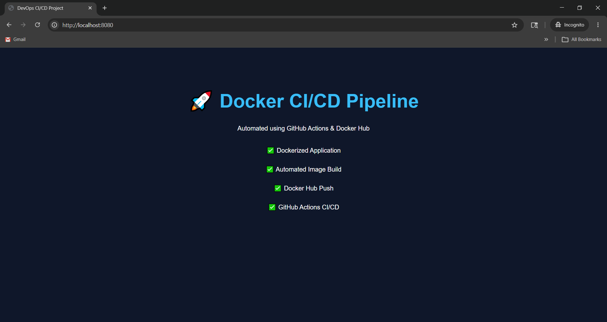

# 🚀 GitHub Actions Docker CI/CD


A simple DevOps CI/CD project demonstrating automated Docker image build and deployment using GitHub Actions and Docker Hub.

---

# 📌 Project Overview

This project showcases:

- ✅ Dockerized static web application
- ✅ CI/CD pipeline using GitHub Actions
- ✅ Automated Docker image build
- ✅ Docker Hub image publishing
- ✅ Nginx container deployment

The application is automatically built whenever code is pushed to the repository.

---

# 🖼️ Application Preview




---

# 📂 Project Structure

```bash
github-actions-docker-cicd/
│
├── .github/
│   └── workflows/
│       └── docker-publish.yml
│
├── app/
│   ├── index.html
│   └── style.css
│
├── screenshots/
│   └── localhost-output.png
│
├── Dockerfile
└── README.md
```

---

# 🖥️ Application UI

The web application displays:

- 🚀 Docker CI/CD Pipeline
- ✅ Dockerized Application
- ✅ Automated Image Build
- ✅ Docker Hub Push
- ✅ GitHub Actions CI/CD

---

# ⚙️ CI/CD Workflow

The GitHub Actions pipeline automatically:

- Checks out source code
- Builds Docker image
- Generates SHA-based image tags
- Pushes images to Docker Hub
- Runs on every push and pull request

---

# 🐳 Docker Image Tags

Images are pushed with:

```bash
latest
sha-<commit_sha>
```

Example:

```bash
kiranhingankar/github-actions-docker-cicd:latest
kiranhingankar/github-actions-docker-cicd:sha-a1b2c3d
```

---

# 🔐 Required GitHub Secrets

Go to:

```text
GitHub Repository → Settings → Secrets and variables → Actions
```

Add the following secrets:

| Secret Name | Description |
|---|---|
| `DOCKER_USERNAME` | Docker Hub username |
| `DOCKER_TOKEN` | Docker Hub access token |

---

# 🚀 Run Locally

## Build Docker Image

```bash
docker build -t github-actions-docker-cicd .
```

## Run Docker Container

```bash
docker run -d -p 8080:80 github-actions-docker-cicd
```

---

# 🌐 Access Application

Open in browser:

```text
http://localhost:8080
```

---

# 📦 Useful Docker Commands

## View Running Containers

```bash
docker ps
```

## Stop Container

```bash
docker stop <container_id>
```

## Remove Container

```bash
docker rm <container_id>
```

## Remove Docker Image

```bash
docker rmi github-actions-docker-cicd
```

---

# 🛠️ Technologies Used

- HTML5
- CSS3
- Docker
- Nginx
- GitHub Actions
- Docker Hub

---

# 📈 Future Improvements

- ✅ Multi-stage Docker builds
- ✅ Kubernetes deployment
- ✅ Helm charts
- ✅ Docker image security scanning
- ✅ Automated cloud deployment
- ✅ Multi-architecture support
- ✅ Monitoring & logging integration

---

# 🤝 Contributing

Contributions are welcome.

Feel free to fork this repository and submit pull requests.

---

# ⭐ Support

If you found this project useful:

- ⭐ Star this repository
- 🍴 Fork the project
- 🐛 Report issues
- 🚀 Share with others
---

# 👨‍💻 Author

Developed by **Kiran Hingankar**
